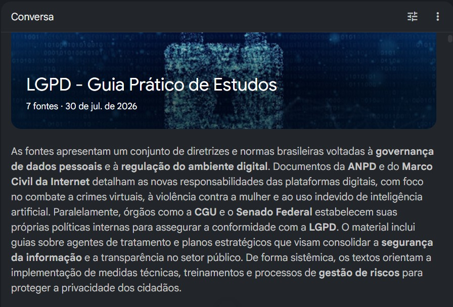
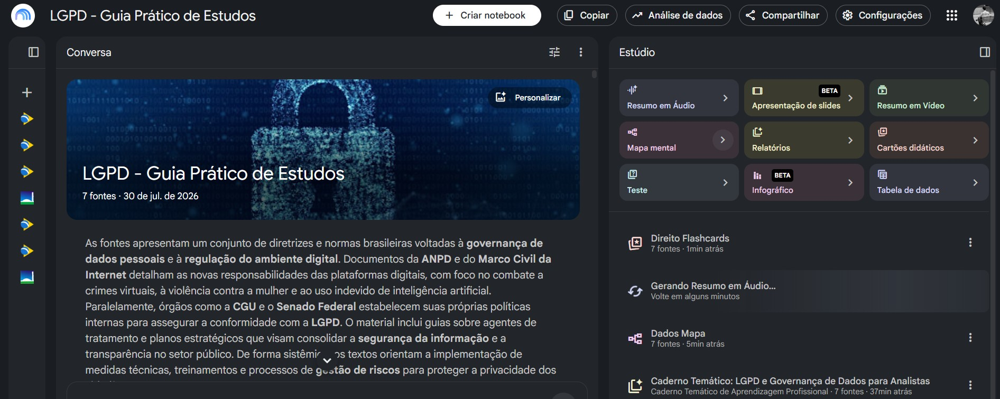
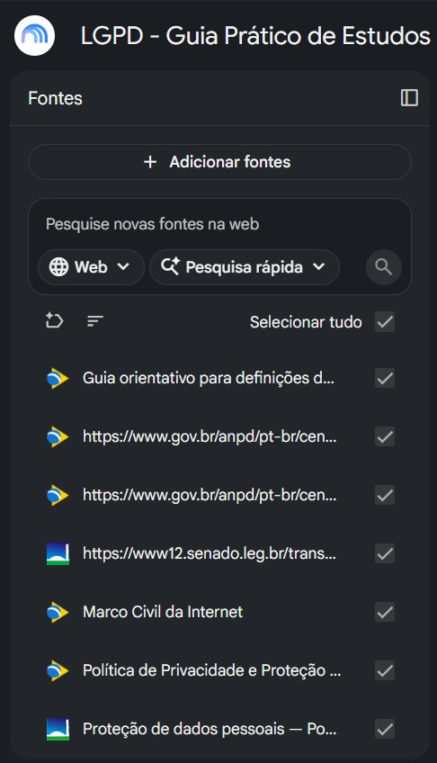
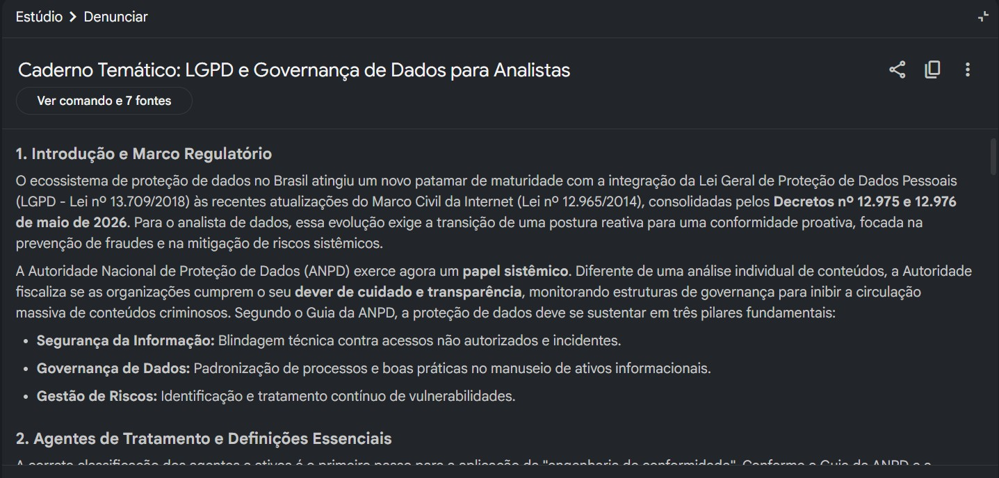
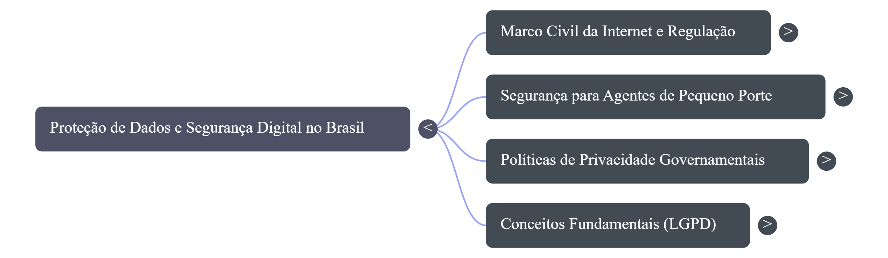

# LGPD: Guia Prático de Estudos com NotebookLM

# Índice

- [Sobre o Projeto](#sobre-o-projeto)
- [Objetivos de Estudo](#objetivos-de-estudo)
- [Competências Desenvolvidas](#competências-desenvolvidas)
- [Curadoria de Fontes](#curadoria-de-fontes)
- [Metodologia](#metodologia)
- [Engenharia de Prompts](#engenharia-de-prompts)
- [Desafios](#desafios)
- [Demonstração](#demonstração)
- [Miniguia de Estudos: LGPD em Resumo](#miniguia-de-estudos-lgpd-em-resumo)
- [Glossário](#glossário)
- [Perguntas de Revisão](#perguntas-de-revisão)
- [Prompts Reutilizáveis](#prompts-reutilizáveis)
- [Resultados Obtidos](#resultados-obtidos)
- [Reflexão Final](#reflexão-final)
- [Tecnologias Utilizadas](#tecnologias-utilizadas)
- [Autora](#autora)

---

# Sobre o Projeto

Este repositório apresenta um **Caderno Temático** desenvolvido no **Google NotebookLM** sobre a **Lei Geral de Proteção de Dados Pessoais (LGPD)** como parte do desafio prático do Bootcamp Universia – Primeiros Passos em Power BI, incluindo o Bootcamp Universia | Fundamentos de IA Generativa, promovido pelo Santander Open Academy em parceria com a DIO.

O objetivo foi utilizar Inteligência Artificial como ferramenta de **aprendizagem ativa**, organizando documentos oficiais, elaborando perguntas estratégicas e consolidando o conhecimento em um material reutilizável para estudos futuros.

Mais do que resumir a legislação, este projeto buscou compreender a aplicação prática da LGPD para profissionais que trabalham com **Análise de Dados, Business Intelligence, Governança de Dados e Monitoramento**, aproximando os conceitos jurídicos da realidade das organizações.

Toda a construção foi baseada em documentos oficiais e nas orientações da Autoridade Nacional de Proteção de Dados (ANPD), buscando desenvolver um material confiável, organizado e útil para consultas futuras.

---

# Objetivos de Estudo

Durante a construção deste NotebookLM foram definidos os seguintes objetivos de aprendizagem:

- Compreender a estrutura da LGPD;
- Identificar seus princípios fundamentais;
- Compreender o conceito de tratamento de dados pessoais;
- Diferenciar dados pessoais e dados pessoais sensíveis;
- Conhecer os direitos dos titulares;
- Compreender as bases legais do tratamento;
- Diferenciar Controlador, Operador e Encarregado (DPO);
- Entender o papel da ANPD;
- Compreender como a LGPD impacta profissionais de dados;
- Estudar boas práticas de Governança de Dados;
- Relacionar a LGPD ao uso de Inteligência Artificial;
- Aplicar os conceitos em estudos de caso e situações reais.

---

# Competências Desenvolvidas

Durante este projeto foram desenvolvidas competências importantes para profissionais da área de dados:

- Curadoria de fontes oficiais;
- Aprendizagem ativa com Inteligência Artificial;
- Engenharia de Prompts;
- Organização do conhecimento;
- Documentação técnica em Markdown;
- Síntese de documentos técnicos;
- Interpretação de legislação;
- Governança de Dados;
- Segurança da Informação;
- Pensamento crítico para validação das respostas geradas por IA;
- Versionamento e documentação utilizando GitHub.

---

# Curadoria de Fontes

Foram selecionados documentos oficiais e materiais públicos para garantir maior confiabilidade às respostas produzidas pelo NotebookLM.

| Documento | Objetivo |
|-----------|----------|
| Lei nº 13.709/2018 (LGPD) | Base legal principal do estudo |
| Guias da ANPD | Orientações práticas para aplicação da LGPD |
| Marco Civil da Internet | Complementação do contexto jurídico digital |
| Documentos da CGU | Governança e proteção de dados no setor público |
| Materiais do Senado Federal | Apoio à compreensão da legislação |
| Planos Estratégicos da ANPD | Governança, fiscalização e segurança |
| Guias sobre Agentes de Tratamento | Responsabilidades de Controladores, Operadores e Encarregados |

Todos os documentos utilizados são públicos e possuem caráter institucional.

---

# Metodologia

Este projeto foi desenvolvido utilizando uma abordagem de **aprendizagem ativa**, na qual a Inteligência Artificial foi utilizada como ferramenta de apoio, sem substituir a análise crítica dos documentos. O processo foi dividido em cinco etapas:

### 1. Curadoria

Seleção de documentos oficiais relacionados à LGPD.

### 2. Organização

Importação das fontes para o NotebookLM.

### 3. Engenharia de Prompts

Construção de perguntas estratégicas para explorar os documentos sob diferentes perspectivas.

### 4. Consolidação

Produção de resumos, comparações, estudos de caso, mapas mentais e materiais de revisão.

### 5. Documentação

Organização de todo o processo em um repositório GitHub para servir como material de estudo e portfólio profissional.

## Benefícios do NotebookLM (Identificados durante o Projeto)

Durante o desenvolvimento deste material foi possível perceber algumas vantagens do NotebookLM:

- Centralização de múltiplas fontes em um único ambiente;
- Respostas fundamentadas nos documentos enviados;
- Criação rápida de resumos;
- Geração de perguntas de revisão;
- Construção de mapas mentais;
- Auxílio na organização do conhecimento;
- Facilidade para revisões futuras.

Ao mesmo tempo, ficou evidente que a qualidade das respostas depende diretamente da qualidade das fontes utilizadas e da elaboração de prompts claros e específicos.

---

# Engenharia de Prompts

Um dos principais aprendizados deste projeto foi compreender que a utilização de Inteligência Artificial depende não apenas da ferramenta escolhida, mas também da capacidade de formular perguntas claras, contextualizadas e estratégicas.

No NotebookLM, os prompts foram utilizados como instrumentos de investigação, revisão e construção do conhecimento.

A elaboração das perguntas seguiu alguns princípios:

- Definir claramente o objetivo da análise;
- Contextualizar o papel esperado da IA;
- Solicitar respostas estruturadas;
- Incentivar comparações e exemplos práticos;
- Estimular pensamento crítico sobre o conteúdo apresentado.

## Exemplos de Prompts Utilizados

### Compreensão Inicial da Legislação

**Prompt:**

> Explique os principais conceitos da LGPD para uma pessoa que está iniciando seus estudos sobre proteção de dados. Utilize exemplos práticos do cotidiano das organizações.

**Objetivo:**

Construir uma visão geral da legislação antes de aprofundar conceitos específicos.

### Comparação de Conceitos

**Prompt:**

> Crie uma tabela comparativa entre dado pessoal, dado pessoal sensível e dado anonimizado, apresentando definição, exemplos e impactos relacionados à LGPD.

**Objetivo:**

Facilitar a diferenciação entre conceitos fundamentais da legislação.

### Aplicação Profissional

**Prompt:**

> Explique como a LGPD impacta a rotina de um Analista de Dados, considerando coleta, tratamento, armazenamento, análise e compartilhamento de informações.

**Objetivo:**

Relacionar a legislação com atividades práticas da área de dados.

### Estudos de Caso

**Prompt:**

> Crie situações hipotéticas envolvendo organizações que precisam aplicar a LGPD e explique quais princípios, direitos e responsabilidades estão envolvidos.

**Objetivo:**

Transformar conceitos teóricos em situações aplicáveis.

---

# Desafios

Durante o desenvolvimento do projeto, alguns desafios foram identificados e solucionados.

## 1. Seleção das fontes adequadas

### Desafio:

A quantidade de materiais disponíveis sobre LGPD é extensa, incluindo artigos, notícias, interpretações jurídicas e conteúdos produzidos por diferentes instituições.

### Solução:

Foi priorizada a utilização de documentos oficiais e institucionais, especialmente:

- Lei nº 13.709/2018;
- Materiais da ANPD;
- Documentos de órgãos públicos;
- Conteúdos educativos relacionados à proteção de dados.

### Aprendizado:

A qualidade da resposta gerada por uma Inteligência Artificial está diretamente relacionada à qualidade das informações utilizadas como base.

## 2. Evitar respostas genéricas da Inteligência Artificial

### Desafio:

Perguntas muito amplas podem gerar respostas superficiais ou pouco relacionadas ao objetivo do estudo.

### Solução:

Os prompts foram refinados adicionando:

- Contexto profissional;
- Objetivo da análise;
- Formato esperado da resposta;
- Exemplos práticos.

### Aprendizado:

A engenharia de prompts é uma competência essencial para transformar a IA em uma ferramenta de produtividade e aprendizagem.

## 3. Transformação de informação em conhecimento

### Desafio:

Apenas reunir documentos não garante aprendizado.

### Solução:

Foram utilizadas estratégias como:

- Perguntas de revisão;
- Comparações;
- Resumos estruturados;
- Mapas mentais;
- Estudos de caso.

### Aprendizado:

O conhecimento é construído quando a informação é organizada, interpretada e relacionada com situações reais.

---

# Demonstração

A construção do projeto foi realizada utilizando o Google NotebookLM como ambiente principal de organização e exploração das fontes.

## Estrutura desenvolvida:

### Caderno Temático

Organização dos documentos utilizados como base para consulta e análise.

### Resumos Inteligentes

Utilização da IA para auxiliar na síntese dos principais conceitos da LGPD.

### Perguntas de Revisão

Criação de questões para testar a compreensão dos conteúdos estudados.

### Mapas Mentais

Representação visual das relações entre conceitos importantes.

### Material de Consulta

Consolidação dos aprendizados em formato reutilizável para estudos futuros.

---

## Imagens do Projeto

A seguir estão algumas capturas de tela do NotebookLM utilizado durante o desenvolvimento deste projeto.

## Título e Descrição

## Visão Geral

## Lista de Fontes

## Guia de Estudos

## Mapa Mental

---

# Miniguia de Estudos: LGPD em Resumo

## O que é a LGPD?

A Lei Geral de Proteção de Dados Pessoais (Lei nº 13.709/2018) estabelece regras para o tratamento de dados pessoais por pessoas físicas, empresas e organizações públicas ou privadas.

Seu principal objetivo é proteger os direitos fundamentais de liberdade, privacidade e desenvolvimento da personalidade das pessoas.

---

## O que são dados pessoais?

São informações relacionadas a uma pessoa natural identificada ou identificável.

Exemplos:
- Nome;
- CPF;
- Endereço;
- Telefone;
- E-mail;
- Localização;
- Informações de cadastro.

---

## O que são dados pessoais sensíveis?

São dados que possuem maior potencial de causar impactos aos titulares caso sejam utilizados de forma inadequada.

Exemplos:
- Origem racial ou étnica;
- Convicção religiosa;
- Opinião política;
- Informações relacionadas à saúde;
- Dados genéticos ou biométricos.

---

## O que significa tratamento de dados?

Tratamento corresponde a qualquer operação realizada com dados pessoais.

Exemplos:
- Coleta;
- Armazenamento;
- Organização;
- Análise;
- Compartilhamento;
- Eliminação.

---

## Princípios da LGPD

A legislação apresenta princípios que orientam o tratamento adequado dos dados:

| Princípio | Significado |
|-----------|-------------|
| Finalidade | Dados devem ser utilizados para objetivos legítimos e informados ao titular |
| Adequação | O tratamento deve ser compatível com a finalidade informada |
| Necessidade | Utilizar apenas os dados realmente necessários |
| Transparência | Garantir informações claras aos titulares |
| Segurança | Proteger os dados contra acessos indevidos |
| Prevenção | Adotar medidas para evitar danos |
| Responsabilização | Demonstrar adoção de boas práticas |

---

## Bases Legais

A LGPD estabelece hipóteses que autorizam o tratamento de dados pessoais. Algumas delas:

- Consentimento do titular;
- Cumprimento de obrigação legal;
- Execução de políticas públicas;
- Realização de estudos;
- Exercício regular de direitos;
- Proteção da vida;
- Legítimo interesse;
- Proteção do crédito.

---

## Direitos dos Titulares

* Confirmação do tratamento
* Acesso aos dados
* Correção
* Anonimização
* Eliminação
* Portabilidade
* Revogação do consentimento

---

## Agentes de Tratamento

**Controlador:** toma as decisões sobre o tratamento.

**Operador:** executa o tratamento conforme orientação do controlador.

**Encarregado (DPO):** atua como canal de comunicação entre organização, titulares e ANPD.

---

## Boas Práticas

* Utilizar criptografia;
* Aplicar controle de acesso;
* Coletar apenas os dados necessários;
* Registrar operações de tratamento;
* Treinar colaboradores;
* Estabelecer políticas de segurança da informação.

---

# Glossário

## ANPD
**Autoridade Nacional de Proteção de Dados**
Órgão responsável por zelar pela proteção de dados pessoais e pela implementação da LGPD no Brasil.
Entre suas atribuições estão:
- Regulamentar temas relacionados à proteção de dados;
- Fiscalizar o cumprimento da legislação;
- Promover educação e conscientização;
- Aplicar sanções administrativas.

## Dado Pessoal
Informação relacionada a uma pessoa natural identificada ou identificável.
Exemplos:
- Nome;
- CPF;
- E-mail;
- Telefone;
- Endereço.

## Dado Pessoal Sensível
Categoria especial de dado pessoal que exige maior proteção devido ao potencial impacto sobre a privacidade e direitos fundamentais do titular.
Exemplos:
- Dados de saúde;
- Dados biométricos;
- Origem racial ou étnica;
- Convicção religiosa;
- Opinião política.

## Titular
Pessoa natural a quem pertencem os dados pessoais tratados.
Exemplo: 
Um cliente, funcionário, estudante ou cidadão que fornece informações para uma organização.

## Controlador
Pessoa física ou jurídica responsável pelas decisões referentes ao tratamento dos dados pessoais.
Exemplo:
Uma empresa que define quais dados serão coletados, por qual motivo e como serão utilizados.

## Operador
Pessoa física ou jurídica que realiza o tratamento de dados pessoais em nome do controlador.
Exemplo:
Uma empresa terceirizada responsável pelo armazenamento ou processamento das informações.

## Encarregado (DPO)
Profissional responsável por atuar como canal de comunicação entre:
- Controlador;
- Titulares dos dados;
- Autoridade Nacional de Proteção de Dados (ANPD).

## Consentimento
Manifestação livre, informada e inequívoca pela qual o titular autoriza o tratamento de seus dados pessoais para determinada finalidade.

## Governança de Dados
Conjunto de práticas, processos e políticas utilizados para garantir que os dados sejam:
- Confiáveis;
- Seguros;
- Acessíveis;
- Utilizados de forma ética e estratégica.

## Privacy by Design
Abordagem que considera a proteção de dados desde a criação de produtos, serviços e processos.
A privacidade deixa de ser uma etapa posterior e passa a fazer parte do planejamento inicial.

## Segurança da Informação
Conjunto de práticas destinadas a proteger informações contra:
- Acesso não autorizado;
- Perda;
- Alteração indevida;
- Vazamento.

---

# Perguntas de Revisão

As perguntas abaixo foram elaboradas para auxiliar na revisão dos principais conceitos estudados durante o projeto.

---

## Conceitos Fundamentais

### 1. Qual é o principal objetivo da LGPD?

**Resposta esperada:** Proteger os direitos fundamentais de liberdade, privacidade e o livre desenvolvimento da personalidade das pessoas naturais, estabelecendo regras para o tratamento de dados pessoais.

### 2. Qual a diferença entre dado pessoal e dado pessoal sensível?

**Resposta esperada:** Dados pessoais identificam ou podem identificar uma pessoa. Dados pessoais sensíveis possuem maior potencial de impacto e recebem proteção especial pela legislação.

### 3. O que significa realizar tratamento de dados?

**Resposta esperada:** Significa realizar qualquer operação com dados pessoais, como coleta, armazenamento, análise, compartilhamento ou eliminação.

---

## Aplicação Prática

### 4. Um Analista de Dados precisa se preocupar com a LGPD? Por quê?

**Resposta esperada:** Sim. Profissionais de dados lidam diretamente com informações pessoais e precisam garantir que a coleta, análise e utilização dos dados estejam alinhadas aos princípios e bases legais da legislação.

### 5. Por que a qualidade das fontes é importante ao utilizar Inteligência Artificial?

**Resposta esperada:** Porque modelos de IA utilizam as informações disponibilizadas como referência. Fontes inadequadas podem gerar respostas incompletas, incorretas ou pouco confiáveis.

### 6. Como a LGPD se relaciona com Governança de Dados?

**Resposta esperada:** A LGPD fortalece práticas de governança ao exigir organização, segurança, transparência e responsabilidade no tratamento das informações.

---

# Prompts Reutilizáveis

* Explique este documento em linguagem simples.
* Faça um resumo executivo.
* Identifique os principais conceitos.
* Gere perguntas de revisão.
* Compare conceitos semelhantes.
* Crie exemplos práticos.
* Monte um quadro comparativo.
* Explique utilizando estudos de caso.
* Crie um mapa mental.
* Gere flashcards para revisão.

---

# Resultados Obtidos

A realização deste projeto permitiu desenvolver uma compreensão mais ampla sobre a LGPD e sua relação com o universo de dados.

Além do conhecimento técnico sobre proteção de informações, foram desenvolvidas competências relacionadas ao uso estratégico da Inteligência Artificial.

---

## Principais Resultados:

- Organização de um caderno temático sobre LGPD utilizando NotebookLM;

- Consolidação de conceitos jurídicos relacionados à proteção de dados;

- Desenvolvimento de uma metodologia própria de estudo utilizando IA;

- Prática de engenharia de prompts;

- Aprimoramento da capacidade de curadoria e análise de fontes;

- Criação de documentação técnica utilizando Markdown e GitHub;

- Aproximação entre conhecimentos de legislação, tecnologia e análise de dados.

---

## Conexão com a Carreira em Dados

Este projeto contribui diretamente para a formação de profissionais que trabalham com dados, pois demonstra que analisar informações envolve muito mais do que ferramentas técnicas. O profissional de dados também precisa compreender:

- Responsabilidade no uso das informações;
- Ética no tratamento de dados;
- Segurança;
- Governança;
- Impactos das decisões baseadas em dados.

A LGPD representa uma dimensão essencial para uma cultura de dados responsável.

---

# Reflexão Final

Este projeto representou uma oportunidade de unir tecnologia, legislação e aprendizagem ativa.

Durante o desenvolvimento, foi possível compreender que a Inteligência Artificial pode ser uma poderosa ferramenta de apoio ao aprendizado, desde que utilizada com senso crítico, responsabilidade e intenção.

O NotebookLM demonstrou potencial para transformar grandes volumes de informação em materiais organizados e personalizados, mas também reforçou a importância da participação humana na seleção das fontes, formulação das perguntas e validação dos resultados.

A experiência fortaleceu competências importantes para profissionais que atuam em ambientes orientados por dados:

- Capacidade analítica;
- Organização do conhecimento;
- Comunicação clara;
- Pensamento crítico;
- Responsabilidade ética.

Mais do que aprender sobre LGPD, este projeto possibilitou refletir sobre um princípio fundamental da era digital:

> Dados representam pessoas. Por isso, todo uso de informação deve considerar não apenas eficiência, mas também responsabilidade.

---

# Tecnologias Utilizadas

- **Google NotebookLM**  
  Organização das fontes, exploração dos documentos e criação do material de estudo.

- **GitHub**  
  Versionamento, documentação e construção do portfólio.

- **Markdown**  
  Estruturação do README e documentação técnica.

- **Documentos oficiais públicos**  
  Base de conhecimento utilizada para análise.

---

# Autora

## Jamille C S Souza

Profissional com experiência em Monitoramento & Avaliação, Análise de Dados e Gestão do Conhecimento, com atuação no desenvolvimento de indicadores, dashboards, análise de bases de dados e produção de relatórios para apoio à tomada de decisão. Bacharela em Ciências e Humanidades, Relações Internacionais e Políticas Públicas pela Universidade Federal do ABC (UFABC). 
Possui interesse em Análise e Governança de Dados, Business Intelligence, Proteção de Dados, Inteligência Artificial e Políticas Públicas.
